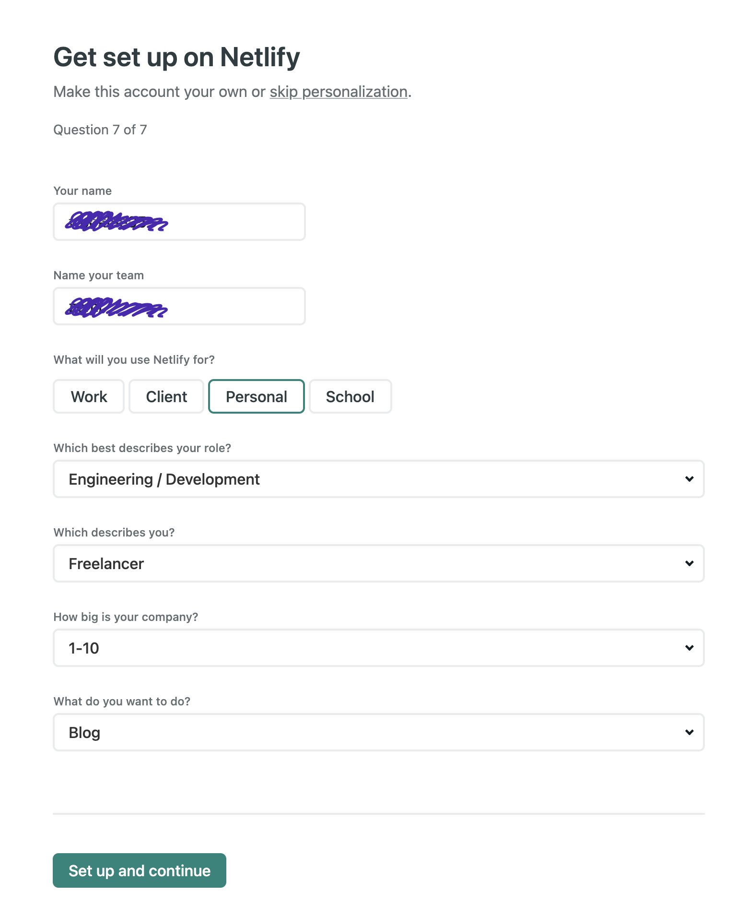

html과 css 자바스크립트로 만든 제 자기 소개 페이지를 배포하려다가 어려움을 겪게 되어서 공유합니다

netlify는 정적 사이트 배포를 아주 아주 아주 아주 손쉽게 도와주는 서비스입니다 !
깃허브와 연동도 되어서 레포지토리에 있는 프로젝트를 쉽게 배포 할 수 있습니다.

## netlify

### 1. <https://www.netlify.com/> 가입하기

우리는 깃허브에 올라가있는 프로젝트를 배포할 예정입니다. 깃허브로 로그인!

  

이름과 팀을 써주고 목적에 맞게 폼을 작성해줍니다!  
회원가입 완료😋

  

### 2. 배포하기

  

메인 페이지 중간에 있는 `New site from Git` 눌러줍니다.

  

깃허브 눌러줍니다.

  

배포할 프로젝트를 repo중에 선택!  
  

배포할 브랜치를 정해줍니다.

그리고

빌드 세팅입니다!

1. html,css,자바스크립트로만! 만들었다면 아무것도 안쓰고 넘어가면 됩니다!
2. 빌드 커맨드가 필요한 경우에만! npm run build 등 써주면 됩니다.  
     

멋지게 배포가 되었습니다🥳

초록색을 누르면 배포된 웹사이트로 이동!

근데 저 긴 이름 보기가 너무 싫다면 ,, Domain settings로 들어갑니다   

옵션을 누르고, Edit site name 을 통해 .netlify.app 의 앞의 부분을 변경할 수 있습니다.  
진짜 배포 끝!

    
제가 netlify를 통해 배포한 간단한 자기소개 사이트 공유합니다.

[링크](https://wook95-introduce.netlify.app/)

 

#### 어려웠던 점

 

저는 처음에 빌드가, 빌드 커맨드가 뭔지도 모르면서 그냥 어디 인터넷에서 보고 npm run build를 때려박았습니다.  
알고 보니 저는 html에 pug도 안썻고, css에 전처리기도 안썻고, 자바스크립트 라이브러리나 프레임워크도 쓰지 않았는데 사실 그러면 바닐라 자바스크립트는 빌드 할 필요가 없는 것이었어요!

맞아요 정답은 빌드 커맨드 쓰는곳에 아무것도 쓰지 않으면 되는 것이었습니다.

덕분에 npm도 깔아보고, 패키지 제이슨에 스크립트로 빌드도 웹팩이라고 한번 써보고 ,, 경험이 되었습니다.

반대로 다음에 Sass와 리액트를 쓴 프로젝트를 배포할땐 빌드 커맨드를 잘 써줘야 하고, 빌드 시에 모듈 번들러인 웹팩을 잘 활용하면 된다는걸 배웠습니다!
