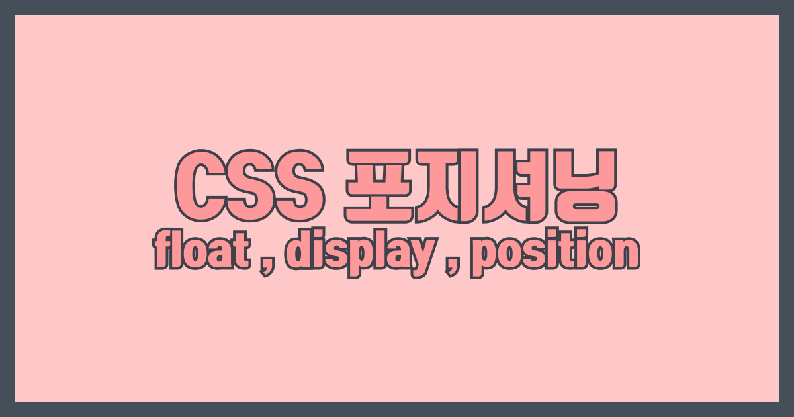

  
내 맘대로 움직여주지 않는 내 div들 ,, 
제대로 움직이려면 두가지면 된다! 바로바로 `flex`와 `position` ..!

flex는 비교적 최근에 나온 속성으로 어렵고 어렵던 가로 정렬을 쉽게 만들어준다.

그럼,, 옛날에는?

초기에는 `table` 로 레이아웃을 짰다는 전설이 있다 ,, 그 후엔 `float` 를 활용 float와 inline-block 등으로 가로 정렬을 해결했다고 한다!

flex를 알기 전에 먼저 float 와 inline-block 그리고 position에 대해 공부해 보고자 한다!

## float

float는 자기를 띄운다..!

텍스트 (또는 인라인)요소가 자기 자신의 주위를 따라 감싸면서 배치되게 하는 CSS 속성(property)..!

<a href="https://learnlayout.com/float.html" target="_blank">예시</a>

float속성의 값으로는 left (왼쪽으로 띄움) , right(오른쪽으로 띄움), none(안띄움)이 있고,

clear 속성은 float 속성을 지운다. (clear의 값은 both, left, right)

 
float의 가장 어려운 점은 자기 부모의 높이를 모른다는것..!
이걸 몰라서 이미지가 div 바깥으로 튀어 나가고 그런다.
  
해결방법 : 부모에 overflow:hidden을 주거나 부모의 pseudo class에 clear:both를 주면 된다.
레이아웃을 만약 float로 잡는다고 생각하면, 부모 요소에 overflow:hidden을 꼭 기억👊🏻

## display : block, inline-block, inline

#### block

대표 태그 : div, p, header같은 시멘틱 태그들, ol과 dl같은 문자 콘텐츠.

특이사항 : 해당 라인의 가로 줄 하나를 다 차지한다. display 속성이 block인 요소들은 매번 새 줄에서 나타난다. vertical-align이 적용되지 않는다  

#### inline

대표 태그 : span, a, img

특이사항 : 요소의 내용 만큼만 차지한다(width와 height는 모두 무시된다). margin과 padding은 좌우만 반영 된다. 새로 선언한 inline 태그들은 바로 옆에 나온다.  

#### inline-block

특이사항 : 인라인처럼 움직이는데, height와 width 지정 가능하고 margin으로 여백도 줄 수 있다.
한줄로 늘어서면서 너비와 높이를 지정할수 있기에 레이아웃에 활용할 수 있다. (그래서 처음에 float와 함께 inline을 언급했다) ➡인라인이지만 늘어난다 !

## position

position 속성의 값은 5가지
  

| 속성 값  | 설명                                                                           |
| -------- | ------------------------------------------------------------------------------ |
| static   | 기본값. 요소를 문서의 흐름에 맞춰 배치                                         |
| relaive  | 이전 요소에 평상시대로 연결.일반적인 흐름. 근데 위치는 지정할수 있음           |
| absolute | 원하는 위치를 지정해 배치. 근데 가장 가까운 relative 기준이고 없을시 body 기준 |
| fixed    | 지정한 위치에 고정. 화면에서 요소 잘릴수도 있음 - 브라우저 창. 보이는 창 기준  |
| Sticky   | 일반적인 흐름에 따름(static). 일정 위치에 다다르면 fixed처럼 변함-스크롤 기준  |

  

내가 겪었던 position 속성😎

경험1 : relative와 absolute의 조합..! 부모에 relative를 주고 자식에 absolute를 주면 자식은 부모를 기준으로 어디든 갈수 있어진다 ..! 검색창에 돋보기 넣기 아주 좋다.

경험2 : fixed 값을 이용하면 브라우저 상단에 붙어있는 헤더를 만들수 있다..!
주의할점은 body태그에 헤더만큼의 마진을 줘야 헤더가 컨텐츠를 안 잡아 먹었다. 주의할점2는 z-index에 신경을 써주면 헤더가 컨텐츠에 가려지지 않을 수 있다.

  

CSS로 요소들을 맘대로 움직이듯이 내 실력도 맘대로 올라갔으면 좋겠다

참고

<https://developer.mozilla.org/ko/docs/Web/CSS/float>

<https://velog.io/@7inug1/CSS-float-%ED%95%B4%EC%A0%9C-%EB%B0%A9%EB%B2%95-%EC%98%88%EC%8B%9C-%ED%8F%AC%ED%95%A8>

<https://1duri1.tistory.com/249>

<https://www.daleseo.com/css-display-inline-block/>

<https://heropy.blog/2019/05/26/html-elements/>

<http://tcpschool.com/css/css_position_display>
