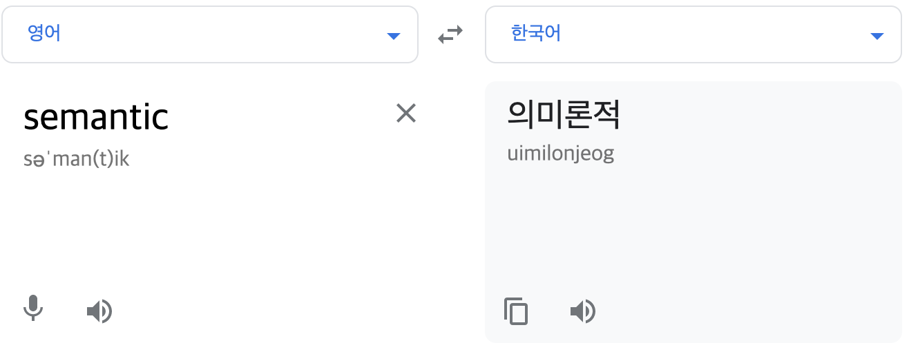

### TL;DR

1. 시맨틱 웹은 웹 표준을 지키게 된다
2. 웹 표준을 지키는것은 웹 접근성과 SEO에 좋다
3. 그래서 img태그와 background-image를 의미론적으로 구분해서 잘 쓰자 (웬만하면 img)

 

## 시맨틱

이미지 태그와 background-image 속성 ,, 
어떤 차이인지 이걸 알기 위해선 웹에서 말하는 시맨틱이 뭔지 알아야 한다👊🏻
  
시맨틱(Semantic)

우리가 만드는 HTML에는 많은 태그 있다
두개로 나눈다면 시맨틱 태그와 안 시맨틱 태그 즉 
의미가 있냐 없냐로 나뉜다.
  

태그에 무슨 의미가 중요하냐고 이쁘게 잘만 만들면 된다고 생각하다면 명백히 경기도 오산 ,, (여기서 말하는 의미는 HTML을 봤을때 이게 제목이구나 이게 메뉴 바 이구나 하는 정보)
물론 div와 span 태그 범벅으로도 CSS가 들어가면 멋지게 만들수는 있다..! 하지만 그치만 HTML 한눈에 보았을때 div만 있다면 css로 아무리 멋지게 꾸며도 뭐가 제목인지 뭐가 중요한 의미를 가지는 태그인지 모른다
   
그래서 나온 header,footer와 같은 시맨틱 태그,
제가 이해하기로 `의미 있는 div`..! 딱 봐도 머리에 들어갈 것들, 마지막에 들어갈 것들, 제일 중요한 메인 기사, 메뉴 바 같아 보이는 것들..!

  

이것들을 통해 뭐가 제목인지 뭐가 중요한 내용인지 구조를 알려준다

1. 검색에 도움을 준다
2. 스크린 리더 같은 장애인 지원 프로그램들이 제목이라고, 메뉴 바 라고 인식해서 웹 접근성에 도움을 준다

또한 시맨틱하게 HTML을 짜는것이 웹 표준을 잘 지키는것..!

## 웹 표준

W3C가 정한 웹의 표준!

https://www.koreahtml5.kr/front/reference/referenceView.do?bbsId=BBS_00000000002

웹 표준을 잘 지켜서 코딩 해야하는디 이유는

1. 검색엔진 최적화,, 표준이라는 기준
2. 모바일환경및 장애인 지원용 (웹 접근성 = 누구든 웹을 이용할 수 있어야 한다)

3. 브라우저가 알아듣기 쉽도록

예시로 img태그엔 alt라는 속성이 있는데 안써도 사진 잘만 나온다. 하지만 웹 표준을 위해선 꼭 써줘야 한다..! 만약 시각 장애인이 내가 만든 페이지에 들어왔는데 alt가 없으면,, 무슨 그림인지 알 수 없으니까..! (웹 접근성)

웹 표준 검사기 : https://validator.kldp.org/

## img태그와 div에 background-image 

그래서 처음에 고민했던 둘은 어떤 차이가 있을까 !
  
머리속으로 생각 했을때 img 태그는 더 다양하게 이미지를 조정할 수 있을것 같고 div 태그는 의미상 그냥 배경 이미지,, 라고만 생각이 되어졌다

사실은 그냥 배경이미지가 아니라 : 컨텐츠에 필요해 첨부하는 사진이 아니라 디자인 적으로 배경이 되게 필요한 이미지! img 태그의 사진은 컨텐츠에 필요한 사진!

 
img와 background 둘을 의미적으로 구분해서 써야한다

다만 background-image 속성을 쓰면 

1. seo에 악영향,
2. 스크린 리더에서도 이미지라고 모르기 때문에 접근성 웹 표준에 안 좋고,
3. 퍼포먼스도 안좋다,, css에서 이미지를 처리하기 때문에 다운로드 큐에서 밀린다 -> 늦게 로딩

 

성능상 이렇게 다르고, 일반적으로 페이지에 들어가는  이미지를 쓰기 위해 background 사용은 자제하는게 좋을것 같다, 대신 말 그대로 배경 이미지 컨텐츠와 관련 없는 디자인 적인 요소로 쓰려고 할 때는 마냥 나쁘지는 않은것 같다!

우리도 우리의 의미가 뭔지 자꾸 궁금해 하듯 컴퓨터한테도 이 HTML이 무슨 의미가 있는지 잘 알려줘야 겠다고 생각했다

  
참고

https://mygumi.tistory.com/369

https://nystudio107.com/blog/the-css-background-image-property-as-an-anti-pattern

https://blog.px-lab.com/html-img-tag-vs-css-background-image/
 
 