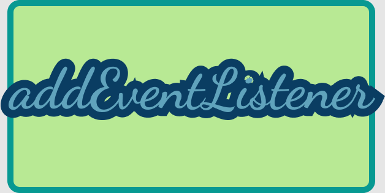

### TL; DR

- 이벤트 핸들러를 익명함수로 감싸주고 리턴하는 덩어리를 이벤트핸들러로!
  <br>
  <br>

### 겪었던 문제

스타벅스 홈페이지를 바닐라 자바스크립트로 클론하면서 기능을 이것 저것 추가해봤습니다.
하트 버튼을 누르면 색이 채워지고, 다시 누르면 없어지는 기능을 여기 저기 온갖 곳에 구현해보려고 했는데,,, 똑같은걸 여기 저기 쓰는게 맘에 걸려서 공부해봤습니다.

<br>

### addEventListener

```javascript
이벤트_걸고싶은_타겟.addEventListener('이벤트타입', 콜백함수, [, 캡처사용여부])
```

오늘 궁금했던것은 바로 저 콜백함수! 다른 이름으론 이벤트 핸들러!<br>
이벤트 리스너의 콜백함수의 제어권은 이벤트 리스너가 갖기 때문에<br>
자기 멋대로 콜백함수의 첫번째 인수는 무족권 이벤트 객체를 주입해버립니다. 그렇게 설계 되었습니다!  
그래서 파라미터에 무엇을 넣어도 이벤트객체만 나오는 것이지요..!

<br>

제가 하고 싶었던 것은 `타깃.addEventListener('click',handleHeart(타깃))` 입니다.<br>
같은 기능을 하는 이벤트 핸들러 함수 하나만 만들고 타깃만 쓱 싹 바꿔가면서 이벤트 등록해주기 ! ! ! !
<br>
<br>

### 해결

원래 쓰려고 했던 이벤트 핸들러를 함수로 감싸주고, 반환해줬습니다.<br><br>

|이벤트 핸들러

```javascript
let handleHeart = function (heart){
  return function(){
    if(heart.classList[0]==='empty'){
      heart.classList.replace('empty','solid');
    }else if(heart.classList[0]==='solid'){
      heart.classList.replace('solid','empty');
    }
  }
```

|이벤트 등록

```javascript
let likes = document.querySelectorAll('.content-box__review--like')
const heart = document.querySelector('.header--like').firstElementChild

heart.addEventListener('click', handleHeart(heart))
;[...likes].forEach(el => {
  el.firstChild.addEventListener('click', handleHeart(el.firstChild))
})
```

<br>
handleHeart 함수는 익명함수를 반환합니다!
이 리턴되는 익명함수야말로 이벤트 리스너가 좌지우지 할 수 있는 함수가 됩니다.<br>
(리턴되는 익명함수의 파라미터에 인수로 e를 넣어주고 출력해보면 이벤트 객체가 나옵니다!)

그렇기에 handleHeart 함수의 인수 heart는 (생명주기가 끝나도 쓸수 있는 변수)클로저 덕분에 이벤트 객체가 아닌 heart가 될 수 있습니다!
<br><br>
