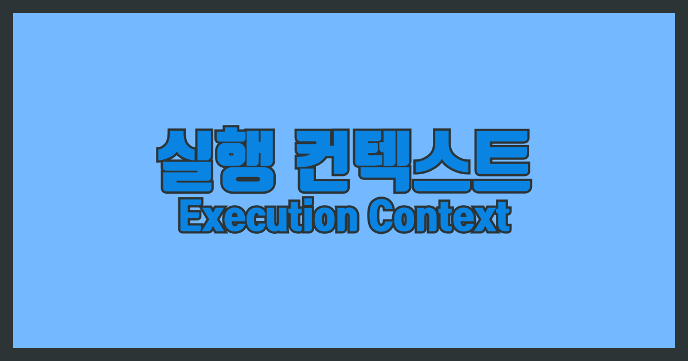

실행컨텍스트를 제대로 알아야 클로저, 스코프 기반의 변수 관리, 호이스팅에대해 알 수 있다.

## 실행 컨텍스트

실행 컨텍스트는 객체이다.  
코드 실행에 필요한 환경 정보가 들어 있는객체. 퉁 쳐서 보면 변수 사전이라고도 볼 수 있겠다.
이 실행 컨텍스트를 콜 스택에 쌓아올리고, 제일 위에 있는 실행 컨텍스트 관련 코드를 실행하는 것이 자바스크립트 코드의 순서이다.

실행컨텍스트에 담기는 정보들은 세가지다.

1. Variable Environment
2. Lexical Environment
3. This Binding

실행 컨텍스트는 전역 코드를 만날때, 함수가 실행될때 만들어진다.

 <h4 style="display:contents">더 알기</h4>

1. 전역코드 평가시, 함수코드 평가시, eval코드 평가시, 모듈코드 평가 시  
   실행컨텍스트가 생성된다. 일반적인 경우 함수 실행할 때 실행컨텍스트가 만들어진다고 생각하면 된다.
2. 실행 컨텍스트가 만들어진다고 바로 콜스택에 푸쉬 된다는것은 아니다. 렉시컬 환경에 식별자 정보들이 다 수집이 되었을 때 푸쉬된다.

## 코드의 평가와 실행

우리 자바스크립트의 모든 코드는 2단계를 거친다. 평가와 실행.
 

**`평가`**시에 실행 컨텍스트가 생성되고,  
함수선언문과 변수 선언문이 먼저 실행되어 렉시컬 환경의 레코드에 등록한다. (실행컨텍스트가 관리하는 스코프에 등록한다는 말)  
이 때 var 키워드로 선언된 변수들의 경우 선언과 동시에 초기화가 일어나 undefined로 초기화 되지만,  
let의 경우 선언과 초기화가 따로 일어나기에 변수 선언문에 도달하기 전까지 참조할 수 없는 임시적 사각지대에 빠진다.
 

**`실행`**시에 한줄씩 코드가 실행된다. 런타임이 시작된다. 실행시에 필요한 정보 (변수 정보,함수정보)는 렉시컬 환경을 통해 검색한다. (실행 컨텍스트가 관리하는 스코프를 통해 찾는다는 말)

## 실행 컨텍스트 구조

### Variable Environment

Lexical Environment와 초기엔 같다. 왜냐하면 렉시컬 환경의 초기 스냅샷이 Variable Environment라고 생각하면 되기 때문.

### Lexical Environment

어휘적 환경 이라는 말이다. 변수 사전이라고 생각하면 편하다.

렉시컬 환경 안에는 또 두가지 정보가 있다.

1. `환경 레코드 (Environment Record)` : 현재 컨텍스트와 관련된 식별자 정보들이 저장된다.

2. `외부 렉시컬 환경에 대한 참조(Outer Lexical Environment Reference)`: 상위 스코프를 가리킨다. 단방향 링크드 리스트인 스코프 체인을 구현한다. 지금 실행중인 실행 컨텍스트의 렉시컬 환경을 가리키게 된다. (렉시컬 환경이 완성되기 전엔 콜스텍에 푸쉬되지 않으므로 상위 스코프는 현재 콜스텍 최상단 실행 컨텍스트이다.) 이는 클로저를 위한 힌트가 되는데, 이 상위 스코프를 가리키는 참조가 없어지지 않기에 GB가 수집하지 않아 클로저가 성립할 수 있다.

### This Binding

실행컨텍스트가 생성될 때. 함수가 평가될때 this값이 어떤것을 가리키게 되는지 결정된다.  
일반 함수이면서 this를 가리키는 값이 지정되지 않는다면 전역객체를 가리키게 된다.  
따라서 함수는 어디에서 선언 되었는지가 중요한것이 아니라, 어떻게 실행되는지에 따라 this가 달라진다.

## 코드에서의 실행 컨텍스트

코드가 실행되려면 스코프, 식별자, 코드 실행 순서의 관리가 필요한데 이것을 실행 컨텍스트가 해준다.
환경을 제공하고, 실행결과를 관리하는 영역이다.
스코프와 식별자는 렉시컬 스코프를 통해, 실행 순서는 콜스텍을 통해 관리하게 된다.
