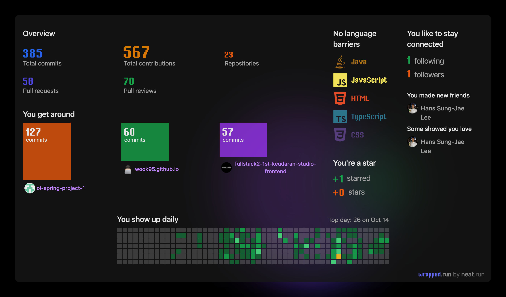
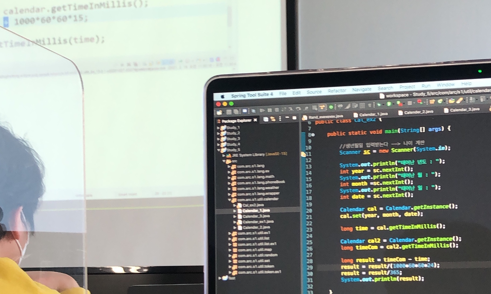
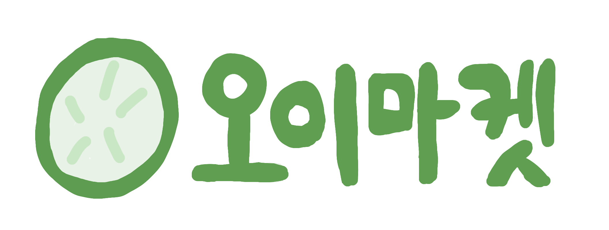
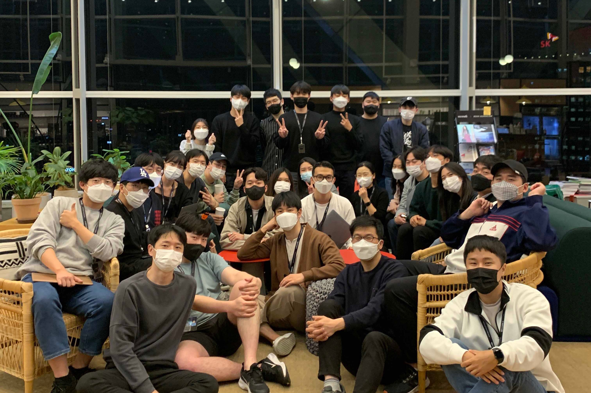
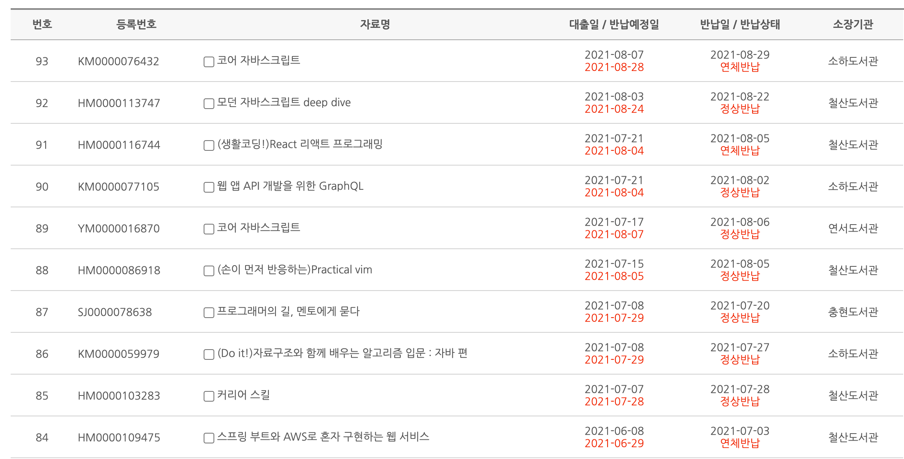

# 시작

왜 개발을 하게 되었을까?

이 전에는 전기 공부를 시작했었다. 전공과 비슷한것 같아서, 또 안정적일것 같아서.  
새로운걸 배우니, 모르는게 많다고 생각하고 공부하고 공부했지만  
해도 해도 알고싶지 않고, 어느정도 공부했다고 생각했는데도 갈 길이 무척 멀었다.

이것은 계속 계속 궁금해지지가 않는데, 최종적으로 나는 어떤 분야의 전문가가 되고 싶었다.  
누구를 앉혀놔도 할 수 있는 일이 아니라 내 기술, 내 커리어를 가지고 싶었다.  
지금 하는 것이 앞으로 계속 할 일, 커리어를 쌓아가고 싶은 일을 공부하는것이라면 지속하는것 보다 방향을 조정할 필요를 느꼈다.

내가 뭘 잘하고 뭘 좋아하는지에 대해 생각했고  
취업을 위한 공부보다 내 기술을 위한 공부를 더 하고 싶었다.  
떠올려 낸것이 코딩 . . !

개발자들만의 문화가 있는것도 멋지다고 생각했다.  
합리적인 의사결정을 할 수 있지 않을까 . .!  
그렇게 시작했다.

# 쌍용 교육센터

 

강사님이 퀴즈 처럼 쉽게 만들어주신 알고리즘 문제와  
주말 숙제라면서 내주신 자바로 만드는 텍스트 게임이 생각난다.  
강사님 덕분에 딱 재밌게 어려운 난이도로 처음을 잘 시작했다.

## 1차 프로젝트

모르는것이 있어도 혼자 해결하고 싶어서
이리 저리 찾아만 보다가 1주일이 가버렸던 일 기억난다.

리스트 페이지를 반응형으로 만들고 싶어서 4,3,2개로 그리드를 나누기로 목표를 정했는데, 결국 정상적인 코드는 아니지만 동작하는 형태로 만들었던 기억이 있다.

일주일동안 구글에 뭐라고 검색해야 될지도 몰라서 끙긍 앓다가 보기 싫어져서 치위놓고 또 무지성으로 여러가지 css 속성 붙여보기 연속이었다. 지금 와서 생각하면 플렉스로 조지면 되는것인데 ...

다시 돌아간다면 고민 3일차에는 어떤것을 검색해야 하는지와 내 현재 상태를 누구에게라도 물어봤어야 하지 않나 싶다.

아임포트 결제api를 활용해 실제로 결제가 가능하고, 카카오 주소api로 주소를 받아왔다. 외부 api 활용을 해볼 수 있는 좋은 기회였다.  
온라인이라는 한계를 이겨내고 4명의 팀원들과 꾸준히 소통하면서 각자 맡은 것들 완성해 낸것이 좋았다.

## 2차 플젝

당근마켓을 모티브로 한 중고거래 플랫폼이 주제였다.

혼자 프론트 다 만든다고 설쳐서 결국 애지간히 다 만들어버린 일이 생각난다.

돌아보면 프론트가 너무 하고 싶어도 내 능력의 한계를 제대로 인지하지 못하고 내 능력 밖의 일을 한다고 선언해 버린일이라고 생각한다.

1. 내 능력을 알고 티켓을 가져와야 하는게 맞다

선언형이 아닌, jsp로 만들다보니 코드량이 많아지고 . . 중반부엔 점점 지쳐서 결국 채팅 부분 프론트는 다른 팀원이 틀을 만들었다.
처음 계획할때 완성했어야 하는 포인트에도 한창 만들고 있었다. 신입이 일정산정을 잘은 하지 못하겠지만 최대한 내 한계를 알고 그 안에서 목표를 설정해야겠다고 .. 배웠다.

2. 내 위치에 따라 보이는 물건들을 조정하기 위해 wgs84 좌표계를 공부하고, 카카오API 지오코딩을 공부해 1주일만에 해낸 일

처음엔 geolocation으로 접근했었는데, 노트북의 gps가 정확하지 못해 회원가입시 입력받는 정보를 통해 사용자의 위치를 정의했다.

- 저번엔 너무 질문을 안해서, 이번엔 3-4일 고민 후 질문을 바로 했다:  
  질문이 계속되다 보니 그냥 강사님한테 코드 쳐달라고 의지 하는 게 되었다. 돌아보니 질문이 중요한게 아니라 내가 이 상황을 어떻게 극복했냐가 더 중요하다는걸 내 성장이 더 중요하다는걸 다시 생각하게 되었다.
- 일주일만에 극복한 거리 문제가, 페이징 처리 때문에 처음부터 시작하게됨:  
  내 자식같은 코드를 내손으로 갈아엎기. 오히려 좋아 라는 밈이 생각나면서 어디까지 가보나 보자라는 생각으로 임했다...^
  다른 관점이지만, 열심히 했다고 구조를 잘 만든다고 꼭 좋은 상품이 되는것이 아니듯 상품 중심의 개발자가 되야 겠다고 생각했다.
- 트러블 슈팅한 내용을 노션에 정리했는데, 지금 6개월이 지난 시점에 보니까 두번은 읽어야 어떤 말인지 알아들었다:  
  나혼자 읽는것이라고 생각하지 말고 공개하는것이 나에게도 좋은 일이다.  
  [트러블 슈팅 기록](https://www.notion.so/01ca928f34b74ceabe7097a498745e18)

## 더 시도해봤으면 좋았을것 같았던 점

1. 새로운 기술을 혼자서라도 공부해보려고 하지 않았던 점
   - 마이바티스가 아닌 ORM인 JPA를 쓰고싶었는데 . . . 모두가 안쓴다고 그냥 대충 넘어감
   - 결국 뷰단을 거의 혼자 만들었는데 리액트나 뷰를 시도해 보지 않았던 점 (너무 겁 먹었다)
   - 과감히 도전해보자
2. 5.5개월이라는 시간동안 기록한것을 공개하지 않았던 점
   - 노션에 정리한것도 의미가 없진 않지만 세상에 공개 하려고 했을 때 훨신 질이 좋아지기 마련. 미래의 나를 위해서도 좋다
   - 기록을 세상에 공개하기
3. 배포를 포기한점
   - aws를 너무 우숩게 봤다 . . .  
     📚스프링 부트와 AWS로 혼자 구현하는 웹 서비스를 보면서 따라하긴 했는데 발표날까지 성공하지 못했다
4. 학원 외 시간에 공부를 할 시스템을 제대로 만들지 않은것
   - 제네릭, MV1 패턴, 그리고 서블릿이 좀 어려웠었는데 어려운걸로 끝나버렸다.
   - 다가올 위기에 대한 느낌이 온다면 무시하지 말고 전략을 세워놓기 - 국비학원의 머리에 때려박는 공부량은 들었지만 예습-복습에 대한것들을 생각하지 않고 흘러가버림

## 국비학원을 수료하니 얻었던것들

1. 자바의 정수까지는 완벽하게 이해했다고 말하진 못하지만, 프로그래밍 언어의 하나로 활용을 해서 스프링이라는 프레임워크를 활용할 수 있게 되었다.
2. 두번의 프로젝트와 3.5개월의 수업을 통해 개발과 친숙해질 수 있었다.
3. CSS와 html로 페이지를 많이 만들어서 CSS는 충분히 익숙해졌다. BEM도 연습해 볼 수 있었다.
4. 마이바티스로 DB를 건드려서 쿼리를 여러번 짜볼 수 있었다. 조인을 많이 해보았다.
5. 게시판 만들기, 백엔드에서 하는 페이지네이션 가능~~~!

공부를 하다 보니 프론트엔드에 흥미가 생겨서, 프론트로 더 공부해보고 싶어서, 또 새로운 기술들에 대한 흥미가 있어 또다시 학원을 찾게 되었고, 위코드를 선택했다.

# 위코드

내가 위코드 풀스택을 선택한 이유

1. 시기 상, 쌍용 교육센터 수료 후 바로 시작할 수 있었다.

2. 오프라인으로 공부 할 수 있는 곳을 제공해주는 온+오프라인

3. 기업 인턴십 프로그램

풀스택 2기로 시작하게 되어 틀이 많이 잡혀있을거라는 큰 기대는 하지 않고 등록을 했다.  
(오프라인 팀과 다른게 홈페이지가 노션으로 제작되었고 관련 자료가 많이 없어서 처음엔 사기 아닌가 의심을 좀 했었다 . .)

#### 생각과 달랐던 **것은**

함께 하는 사람들이 태어난 후 제일 열심히 하는것처럼 열정있고, 그 외에도 배울점이 많은 사람들이어서 놀랬다.

국비 학원에서는 9시-18시까지 강사님이 하나부터 열까지 떠먹여주는데 비해,
수업 같은 수업은 2시간-4시간 정도이고 나머지는 스스로 풀어가야 했던 시간들이었다. 의도된 맨땅에 헤딩하는듯한 커리큘럼, 최대한 혼자 해결할수 있는 문제 해결력에 집중한듯한 느낌이었다.

 <h4 style="display:contents">후기</h4>

 
  
이 부트캠프를 한단어로 말한다면 몰입이라고 할수 있겠다.
  

사전 스터디 한달부터 부트캠프는 사실 시작이라고 봐야한다.  
사전스터디가 개발의 처음이라면 이때 정말 집중해서 하루 8시간 이상은 해야되지 않나 . . .  
자바스크립트, html, css가 익숙해져야 제대로 따라갈수 있다고 생각한다. . . !

정신없이 달려왔던 4개월  
나를 좋은 환경으로 밀어넣었던 것이 정말 잘했다고 생각한다.  
처음 종로타워 위워크에서 했던 OT, 처음 초대받은 노션 페이지의 16주차 커리큘럼, 열정 가득한 동기들과 하루 종일 투자해야 끝낼수 있던 과제들이 떠오른다.

pre-course가 있던 처음 4주 정말 몰입 그 자체였다.  
일어나자마자 위워크에 가고 하루종일 코딩하고 지하철에서도 코딩하고 집와서도 코딩하고  
다른걸 생각할 시간이 없었다.

더욱 좋았던것은 위코드에서 만난 사람들도 큰 돈 투자한 쉽게 온 사람은 없었고, 다들 열의가 있었다는것.  
난생 처음 해봤던 스터디가 여기서 시작했다. 코어 자바스크립트 책으로 JS를 더 잘 알아갈수 있는 시간이었다.  
위코드에서 강조하는 절대적인 시간 투자가 가능할만한 물리적, 심리적인 환경이다.

비교하지 말라고 하지만 사람들속에서 속에서 비참해지거나, 교만해졌던 나날들 이었고  
아쉬웠던것은 달려만 가다 보니 지치게 되었다.  
프리코스 한달 → 자스2주 리액트2주 노드2주로 진행되는 커리큘럼 중  
노드 2주차에 추석이 끼어 있었는데  
이 때 한번 쉬다가 그동안 쌓아왔던 루틴이 와르르 무너져버렸다. 결국 노드 미션 10단계중 8.8단계까지 끝냇다. .

돌아간다면 추석 주에 나를 제대로 돌아보는 시간을 가지고, 앞날을 도모 했어야 햇는데, 집에 있으면 아무것도 안한다는 사실을 간과한채 그냥 시간에 몸을 맞겨 흘러갔던 시간이었다.  
쉰다고 하면 잘 쉬어야 하는 타이밍 이었는데, 잘 쉬지 못했다.

쉬고 있으면 잘못 되어가는것 같아서 제대로 쉰다는 생각없이 핸드폰만 계속 보면서, 쉰다기 보단 계속 시간과 나를 태워가고 있었다.  
되돌아보면서 스트레스관리가 앞으로도 굉장히 중요하겠구나를 몸으로 느꼈다. 너무 당연한 말이지만 내가 하고 있을땐 모르는것들 . . .

제대로 일하기 위해선 제대로 쉬는 것을 알아야 한다. 내가 어떤 걸 하면 쉴 수 있는지  
스트레스 관리와, 내 한계를 알고, 열정이 꺾이는것을 대비한 시스템을 만들어야한다.

위코드는 정말 알아야 하는것과 무얼 공부해야 하는지 대해 알려주고, 나머지는 알아서 학습해야 한다. 그래서 책도 많이 사고 인강도 많이 봤다. 그렇기 때문에 스스로 공부하기 좋아하고 잘하는 사람이면 정말 잘 맞을것 같다. 나는 그런 점이 잘 맞아서 좋았다.

좋았던 것은 동료, 멘토 코드리뷰가 있었기에 사소한 css부터 로직까지 내 코드에 대해 생각해 볼 수 있었고,  
애자일로 진행한 프로젝트와 인턴십을 통해 스타트업이 어떻게 일하는지를 느낀 점이다.

## 인턴십

[깃허브](https://github.com/wook95/alockRenewal)

인턴십은 1순위로 가고싶은 곳이었던 에이락에서 진행했다.  
에이락이 쓰는 리액트 네이티브라는 기술이 궁금했고 위치도 성수역으로 딱 좋아서 1순위로 선정했다.

프로젝트는 리워드로 지급하는 가상화폐를 보관하는 <u>월렛 서비스</u>를 리뉴얼하는것.  
이제 어플을 새로 만드는 단계여서 개발팀은 이제 뽑힌 1년차 개발자 6명과 3년차 2명, CTO님과 함께했다.

따로 배정받은 소 회의실에서 개발했다.  
(디자이너님이 가끔 간식 주심 , , 최고)

4주간 인턴과정 중 1주일은 리액트 네이티브에 대해 공부할 수 있는 시간을 주셔서
리액트 네이티브를 다루는 기술 책을 사서 1주일동안 한번 스키밍 했다.

맡은 과제는 인당 2~3개의 screen 맡았다.
일주일에 한번씩 전체회의에서 진행상황을 보고했다.

## 맡은 과제

#### 스플래쉬 스크린

처음엔 라이브러리로 갖다 쓸려고 할려고 애를 썼는데  
검색 결과는 애니메이션이 들어간것은 못 만들지 못한다는 사실을 알게 되었다.

많이 쓰는 방법은 js로 스크린을 만들고 스플래시 스크린인척하는것.
그리고 네이티브로 ios, android 각각 첫 화면을 만들어 주는것이었다.

여기서 아쉬웟던 점은 ios, android로 애니메이션의 시작점을 첫 화면을 만드는것을 포기하고
배경색만 따라했던것 . . 돌아보면 어렵진 않지만 익숙치 않았다.
js로는 애니메이션을 만들었는데 ,,, 만들면서 animated의 다양한 메소드와 순서에 대한 공부를 할 수 있었다.

#### 1:1 문의 스크린

여러 공통 컴포넌트를 갖다썼는데, 프로젝트 처음부터 공용 컴포넌트를 직원들이 먼저 만들고 시작하다 보니 실 사용시 개선점이 눈에 보였다.
만든 직원들에게 찾아가서 말하고 수정하기를 계속했다. 처음엔 수정을 부탁했는데, 나중엔 직접 수정 후 pr을 날려 확인 받았다.

특히 여러군데에서 사용되는 모달창이 모달창 바깥을 누르면 사라지는 UX를 주고 싶어서 추가하고, 다른 직원이 만든 컴포넌트에도 여럿 적용한 일이 기억난다.

## 배운점

1. 실제 현업에서는 데드라인이 정말 중요하구나.  
   기술부채를 끌어안고 가는 한이 있더라고 대표님이 어디가서 얘기 할 수 있어야한다.  
   최대한 멋진 구조와 깔끔한 코드 너무 좋지만 개발팀만 안다. . 중요하지만 그것보다 제품 서비스가 우선이 될수 있구나.
     

2. 조금 더 질문, 주체적으로 질문  
   맡은 스플래쉬 스크린에서 안드로이드 네이티브로 작업한 부분을 발표 할 때 CTO님이 다른 방향성을 제시 해 주셔서, 진작 가서 물어봤으면 어땟을까 라는 생각했다.  
   지나면 별거 아니지만 네이티브로 해결한게 기뻐서 그대로 매듭 지었었는데, 한발 더 나아가 되는 부분과 안되는 부분 그리고 더 나은 방향에 대해 CTO님께 보고드렸으면 좋았을 것이라고 생각.  
   스플래쉬 화면이 시작하면서 애니메이션이 나오는데, 나는 애니메이션이 나오기 전 배경부분만 안드로이드로 만들었다. CTO님 말대로 이미지를 여러개 넣어서 처음 스플래시 시작 화면과 동일한 화면으로 만들었으면 더 좋았을 것 같다.
     

3. 직원들이 미리 만들어놓은 공통컴포넌트를 사용 중 고칠점들에 대해 지속적으로 찾아가 여러 직원들에게 말하고 개선했다.  
   pr템플릿이나 git 컨벤션에 대한것도 지속적으로 건의했다.
     

4. 개발자, 기획자, 디자이너 전체 회의에 참여해서 이 에이락 월렛이 어떤 방향으로 가는지에 대해 듣고, 회사의 인턴으로 개발에 참여 할 수 있었던 값진 시간.  
   대학교에서도 강의 하셨던 CTO님의 블록체인 강의 5시간도 좋은 시간이었다.  
    (이더리움으로 살수 있는 NFT 고양이도 보았다)

### 리액트 네이티브

- 리액트만 알면 부담없이 앱 개발 거의 바로 시작할 수 있다.  
  공유하기와 같은 기능들도 리액트 네이티브 자체 api로 쉽게 구현할 수 있다.
- 화면이 작아 css 코드 양이 물리적으로 적다.
  반응형 고려 안해도 된다. (스타일이 기본 flex)
- 각 디바이스를 고려해야 한다. (ios, android, 여러가지 size의 디바이스)
  ex) 안드로이드만의 defaultPadding과 OS별로 공통부분,다른부분이 있는 return key,press effect등
- 아직 0.66 version이다.  
  사소한 버그가 많고, 생각보다 엄청많은 라이브러리 가져다 써야한다.  
  ex) 키보드가 가려지지 않는 옵션을 적용해도 가려지고, textInput에 ref를 주고 focus()를 해도 키보드 안나타나는 버그 등
- css 적용 안되는 속성이 있다. (linear-gradient 등. 물론 라이브러리를 쓰면 된다.)

## 2차 프로젝트

[시연영상](https://vimeo.com/644067169)  
[깃허브](https://github.com/wook95/fullstack2-2nd-ourcodetrip-frontend)

내가 맡은 부분은 리덕스 셋팅, pathname에 따라 변하는 navbar, 카테고리의 collapse였다.

아쉬웠던 점은
다른 팀원들 코드에 대해 물어보고 배울 수 있었다면 어땠을까 싶다.  
어려운 부분을 같이 고민했던 팀원들의 코드는 어느정도 알았지만  
코드 스플리팅, 레이지로딩, 스플래시 스크린에 코드가 어떻게 돌아가는지 자세히 알지 못해 아쉽다.

리덕스와 리덕스 툴킷을 공부해 프로젝트에 도입한것이 좋았다.
useSelector와 useDispatch를 직접 쓰지 않고 커스텀 훅을 사용해 한번 감싸주면서 ui와 상태 관련 로직을 분리시켰다.
상태 관리를 하면서 안 들어볼 수 없는 라이브러리 리덕스를 어떻게 쓰는지와 커스텀 훅의 실 사용을 배웠다.  
특히 리덕스 미들웨어를 이용해 리덕스의 상태 정보를 로컬 스토리지에 저장할 수 있었다.  
이걸 이용해 사용자가 정렬한 카테고리 정보를 기억해 다음에 들어와도 똑같이 정렬되어 있도록 한 부분이 기억에 남는다.

ref에 대해 제대로 이해하지 않고 넘어갔었는데 collapse를 만들면서 한 번 더 공부 할 수 있는 기회가 되었다.

이번 프로젝트는 개인적으로 새로운것들을 도전하고 많이 공부해서 바로 적용했다는점이 좋았다.

## 위코드를 통해 얻은것

처음엔 너무 비싼 돈이라고 생각해 많이 망설였지만  
물리적 정신적 모두 좋은 환경을 산다, 의지를 산다고 생각한다.  
협업 툴, 협업 매너에 대해 배웠고 스타트업을 경험해 보았다.  
애자일, 스프린트로 진행되는 프로젝트 경험, aws를 활용한 배포 경험을 얻었다.

무엇보다 혼자 어떻게든 할 수 있겠다는걸 알았다. 에러메세지와 구글은 거의 모든걸 알려준다.

계속 성장하고자 하는 사람들, 열심히 하고자 하는 사람들과 있을때 너무 동기부여가 되었다.  
회사를 들어갈 때에도, 개발문화가 있고 성장하려는 욕구가 있는 사람들과 함께하고 싶다는 기준이 생겼다.

# 올해의 어려웠던 점

열정이 쪼그라들려고 할 때 대처방법을 생각해놓지 않았다.  
처음에는 너무 열심히 하고 나중에는 지쳐서, 최대 효율을 내지 못했다.

#### 이유

스트레스 관리를 위한 방법을 잘 알지 못했고, 벌려놓은 일에 대한 대비가 되어 있지 않았다.

#### 앞으로는

1. 시스템을 갖추기
   - 📚열정은 쓰레기다, 📚더 시스템
2. 스트레스 관리
   - 마음가짐: 쉴땐 제대로 쉰다는 마음으로
   - 소소한 행복을 느낄 만한 일 찾기 (무거운것 들기, 슬픈영화)
3. 한계에 대해 더 알아가기
   - 메타인지
4. 새로운 기술에 대해 스스로 탐구해보기

# 2022 년에는

#### 1. 영어 회화

위코드를 시작하면서 경리단길에 살기 시작했다.  
근처 해방촌 카페 가면 메뉴판도 영어고 직원도 영어로 말하는게 능숙하다.  
나도 영어 문서는 쫌 읽는데 . . 말을 못하더라 . .  
영어 공부를 하면 공식 문서 읽는데에도, 변수명에도 좋을 것 같다.

#### 2. 오픈소스에 기여해보는것

#### 3. 멋지게 F/E 개발자로 커리어 시작

#### 4. 책 읽기

마음 맞는 학원 동기들과 책을 정해서 자바스크립트, 리액트 스터디를 시작했다.  
1회성으로 끝나는것이 아니라 이렇게 쭉 책을 읽었으면 좋겠다.  
작년에는 언어에 대한 책들을 많이 읽었는데 올해엔 컴공 세계의 고전이라고도 할 수 있는 책들 유명한 책들 한번 읽어보고 싶다.  

#### 5. 운동

쭉 해오던 헬스를 부트캠프 다니면서 지난 2~3개월 쉬었는데 바로 체지방 5% 상승을 겪었다.  
나갈 수 없는 환경이라면 집에서도 운동하자!

#### 6. 불편한 곳에 있기

올해는 거침없이 개발에 도전했었다.  
새로운 분야에 도전한다는 분야에 국한되는것이 아닌 그 마인드  
그 도전하는 마인드를 계속 가져가고 싶다..!  
쾌락이 지속되는 그런 배부르고 등 따신 상태가 아니라 불안하지만 성장할 수 있는 마인드!
