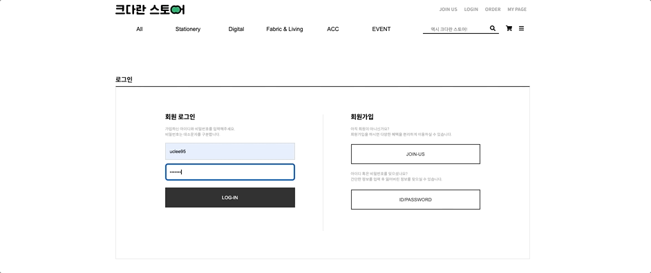

개발 기간 : 21/10/4 ~ 21/10/15  
사용 기술 : React, Node.js, Prisma, Mysql  
<a href="https://github.com/wecode-bootcamp-korea/fullstack2-1st-keudaran-studio-frontend" target="_blank">프론트 레포</a>  
<a href="https://github.com/wecode-bootcamp-korea/fullstack2-1st-keudaran-studio-backend" target="_blank">백엔드 레포</a>

## 총평

배울 게 많이 남아있을거 같은데...! 쥐도 새도 모르게 시작해버린 프로젝트🦖  
거의 코드 친 시간은 일주일도 안 되는 것 같은데,, 사이트가 하나 만들어졌다 ,,  
기획하는 시간을 줄이기 위해 클론 하는 방식을 채택했다고 해도 정말 몰입 하는 시간이 아니었다면 할수 없었지 않았을까 생각이 듭니다.  
신나는 맘으로 시작했지만, 같이 일한다는것은 쉬운일이 아니었고, 일정 산정을 알맞게 하지 못한점이 아쉽습니다.  
하지만 팀 노션에서의 변동사항과 공유사항 전파, 등 의사소통을 위한 노력들이 좋았고, 코드 리뷰를 통해 어디로 가야할지 모르는 코드들은 조금은 방향을 잡는 시간이었습니다. 혼자만 잘 하면 되는게 아니라 같이 잘 하는 능력이 무언인지 엿볼수 있는 기회였습니다.

## 예상과 기대

#### 팀

1. 애자일 방식으로 진행되는 비대면 기반의 프로젝트로 매일 정해진 시간의 회의를 통해 진행상황과 직면한 문제를 공유하고 더 나은 코드를 위해 노력하는 것.
2. 전체적인 개발 프로세스를 경험

#### 개발

1. 구현 하려는 목표 기능의 갯수를 줄여 익숙한 길로 가기보다 새로운걸 시도해보는것.
2. 프론트 : 클래스형 컴포넌트 기반의 프로젝트로 라이프 사이클에 대한 이해를 높이고, 라이브러리를 거의 쓰지 않고 구현해 왜 라이브러리가 필요한지 체감.

 

## 실제

#### 팀

1. 난이도를 신경 쓰지 않고 분배된 이슈 → 정한 일정에 맞춰 해당 이슈를 마무리 짓지 못할뻔 한 상황이 발생
2. 프로젝트 초반엔 standUp 미팅이 잘 진행되었으나 후반엔 코드 치기 바빠 생략하는 일도 생겨 공유가 잘 되지 않음
3. 유럽에서 프로젝트를 진행하는 팀원 → 시차로 인한 소통의 어려움
   <!-- 4. 더 나은 해결을 위한 토론에서 -->

#### 개발

1. 생각보다 마크업에 소요한 시간이 적지는 않았다.
2. 내가 하면 빨리 해결 할 수 있다고 생각했던 팀원들의 이슈를 가져와놓고는 하루종일 걸려서 끝냈다.

## 타임머신을 타고 돌아간다면👽

1. 일정 산정을 최대한 잘 하되, 하루 단위로 일정에 무리가 없는지 나와 다른 팀원 체크. 자기가 한 일에 대해서만 공유를 했기에 어느 정도 진행되었는지 몰라 발표하기 전날이 되서야 급하게 진행한 기능이 있었음.
2. 처음 이슈 정할 때 오래 걸리는 한이 있더라도 필수구현 및 추가 구현을 제대로 정해놀것
3. 기능 한개만 완성하는 한이 있어도, 재밌는것 혹은 새로운 길 가보기
4. 힘들면 쉬기

## 좋았던 점

1. 매일 정해진 시간에 스텐드업 미팅을 했던 것
2. 노션을 활용해 모두가 꼭 알아야 할 내용들에 대해 공유한 것
3. 피어리뷰, 멘토 리뷰를 통해 더 나은 코드를 위해 고민했던 것
4. 여섯 사람이 쓰는 레포지만 한사람이 쓴 코드 처럼 통일성을 주기 위해, 통일한 에러 처리나 컨벤션들을 정해놓은 것

## 생각나는 코드

로그인을 했을 때 네비바에서 로그인 버튼을 로그아웃으로 바꿔주기 위해서 어떡하지 어떡하지 고민하다가, react-router로 라우팅을 해주는 곳까지 올라가서 상태를 정의해주었습니다. 아무래도 아닌것 같은데 하는 찜찜함으로 생각을 가지고 있었는데, 찜찜하다는 생각이 많이 나 생각이 나는 코드 입니다. 다음 프로젝트때에는 전역 상태 관리 라이브러리를 쓰거나 context api를 활용해 해결해 나가고 싶습니다.
