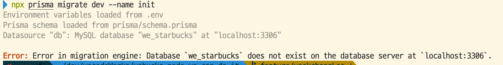
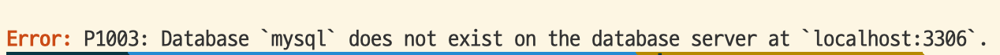
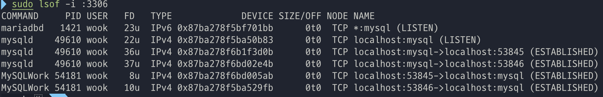
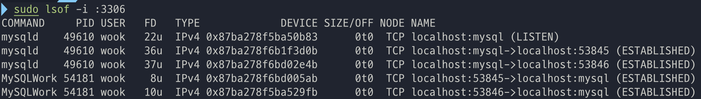

### 문제

 
당연히 될것만 같았던 마이그레이션 ,,, 너가 내 뒷통수를 ,,,,

prisma로 모델을 만들고 마이그레이션을 하는데 문제가 발생했습니다.

번갈아서 나온 에러들입니다.

마이그레이션 엔진에 오류가 났다, 로컬호스트의 3306포트에서 mysql을 찾을수 없다, 데이터베이스 we_starbucks가 로컬호스트 3306포트에 없다.
  

### 해결

 
포트3306에서 쓰고 있는 프로세스들 검색해줍니다.

`sudo lost -i :3306`

  
mariadbd가 살아있습니다 1421번 피드를 죽입니다.

`sudo kill 1421`

  

제대로 죽었나 다시 3306포트를 검색해줍니다.

`sudo lsof -i :3306`

  

정상적으로 mysql만 3306을 쓰고있습니다.

그 후 마이그레이션 성공!
  

### 과정 및 느낌

제 경우엔 포트에서 mysql을 찾을 수 없었던 이유가 마리아db에서 이미 쓰고 있었기 때문이었고, 해당 프로세스를 종료시켰더니 해결이 되었습니다

무지성으로 오타겠거니 싶어서 `npx prisma init`도 여러번 해보면서 기껏 만들어놓은 모델도 날려보고, 공식 홈페이지 docs랑 한자씩 비교해봐도 오타는 없었습니다. 틀린게 없다면 외부에 문제가 있지 않을까 생각을 했습니다

계속 보니 당연하게 넘겼던 에러 메세지가 눈에 밟혔습니다. (3306포트에서 mysql을 못찾는다). 그런데 터미널에서 `mysql -u root -p`로 접속한 데이터베이스는 당연하게도 mysql이 3306에서 잘 돌아가는게 보였고, `SHOW GLOBAL VARIABLES LIKE 'PORT'` 쿼리를 날려봐도 3306이 제대로 나왔습니다. 여기서 한번 방심도 하고

무언가 제 워크벤치도 포트번호가 있나,, 그게 뭔가 충돌한 것인가 마냥 남탓을 하고 있다가, 포트 번호가 자꾸 맘에 걸려서 포트 번호로 검색을 해주었더니, 옛날에 깔고 지웠던 마리아디비가 살아있었습니다. 프로세스 종료해주니 성공쓰..!

트러블 슈팅의 과정 ,, 일단 안되는데에 짜증도 나고 화도 날 수 있겠지만 진짜 문제를 해결하고 싶다면 한발짝 뒤로 물러나는게 필요한것 같습니다. 누가 마법처럼 정답을 알려주면 너무 너무 너무 좋겠지만,, 냉정하게 문제를 바라보는게 1번인것 같습니다. 하기 싫은 마음이 들 때 바로 하기 싫은 나를 보면서 한번 웃으면 그때부터 시작인것 같습니다. 그리고 에러메세지가 있다면 그 메세지가 왜 그렇게 말하는지에 대한 경우의 수를 다 한번 생각해보기가 2번 인것 같습니다. 앞으로 개발을 공부하면서 많은 문제들을 만날텐데 문제를 극복 하는 경험이 하나 둘 쌓여 멋진 개발자로 문제를 해결하는게 즐거운 개발자로 거듭나 보겠습니다~!

  
