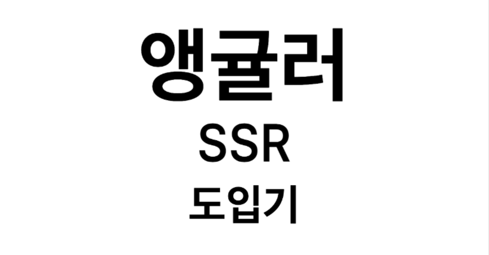

<br/>

검색엔진 최적화를 위해 **CSR**로 구현된 회사 홈페이지를 **SSR**로 바꾸는 프로젝트에 투입 되었습니다.  
초기 환경은 전임자가 16버전으로 앵귤러를 업데이트해 프로젝트를 만든 후 기존 컨텐츠들을 옮겨놓은 상태였습니다.  
이 때에 겪었던 문제를 바탕으로 앵귤러 SSR 도입 후기에 대해 써보려고 합니다.

<br />

## 이전에 경험했던 Next와 Angular SSR의 달랐던 점

```
 추후 알게 되었는데 react에 NEXT가 있다면 Angular의 메타 프레임워크는 AnalogJS
 존재했습니다 만 .. 이 글에선 NEXT와 비교 하겠습니다.
```

### `getStaticProps` 혹은 `getServerSideProps` 같이 서버 단에서 API 패칭이 보장이 되는 메서드가 따로 없었습니다.

<br/>
공식 홈페이지와 수 많은 깃헙 이슈들, 구글 검색을 해봤지만 ... 따로 직관적인 메소드가 존재하지 않았습니다. 추후 귀납적으로 알게 된 것은 서버 단에서 비동기 요청을 실행하려면 꼭 꼭 꼭 앵귤러 내부 API인 HttpClient, 혹은 asyncPipe를 사용해야합니다. 그렇지 않으면 서버에서 비동기 요청을 기다려주지 않았습니다.
<br/><br/>

특히 SPA로 구현되었던 홈페이지에서 사용중인 CMS서비스 ([builder](https://builder.io))
가 있었는데, 빌더에서 제공하는 컴포넌트를 사용하면 서버 단에서 HTML을 만들어주지 않는 문제가 있었습니다. 이메일로 문의해도 아주 예전 버전의 앵귤러만 호환 가능하다고만 답변을 받아서.. 결국엔 혼자 해결했습니다. 해당하는 컴포넌트는 자체적으로 레이지 로딩 혹은 비동기 요청을 보내는 것 같았는데 그래서 문제가 되었던 것 같았고, 빌더측 컴포넌트를 사용하는 대신에 HttpClient를 사용한 API 요청을 통해 정상적으로 서버에서 HTML을 응답 받았습니다.

<br/>

### 메타 태그 설정

페이지 컴포넌트 별로 앵귤러에서 제공하는 Meta 서비스의 메소드 updateMeta를 통해 메타태그를 설정해주어야 했습니다. 단, 한번 updateMeta를 통해 바꾼 메타태그는 다시 updateMeta 메소드를 실행하기 전까진 다른 페이지에 들어가도 바뀌지 않았습니다.

<br/>

### 도입이 빨랐습니다.

이건 메타 프레임워크와의 차이점 일 수 도 있겠지만, 앵귤러에선 SSR 관련한 패키지를 설치하고 조금의 설정을 바꿔주면 바로 도입이 가능했습니다. - [공식 홈페이지의 설명](https://angular.dev/guide/ssr)

( 단 ... 하나의 컴포넌트로 서버에서 한번, 남은건 브라우저에서 한번 실행키므로 컴포넌트 로직에 브라우저 API가 있는 경우 각 컴포넌트마다 분기 처리가 필요했습니다. )

<br/>

## 미숙해서 발생했던 트러블 슈팅

### 앵귤러 SSR을 적용시켰는데, 서버에서 오는 응답 HTML에서는 <app-root /> 뿐 ?

브라우저만 알고있는 window객체, document 객체가 사용된 컴포넌트는 서버에서 랜더링이 안 되기때문에 app-root만 나오는 문제였습니다.

앵귤러 17 SSR에서는 비파괴적인 수화를 지원해 서버에서 HTML을 생성한 뒤 브라우저 단에서 자바스크립트를 붙여 실행을 시켜주는데요, 서버에서 HTML 생성 시 브라우저 API인 window 등의 객체가 있으면 해당 컴포넌트를 건너 뛰고 HTML 생성을 해주었습니다. 따라서 이런 객체를 사용할 때엔 앵귤러SSR API를 사용해 지금 실행되는 플랫폼이 서버인지 브라우저인지 분기처리를 꼭 꼭 꼭 해주어야 합니다.

<br/>

### 애니메이션이 왜 안 나올까요 ?

앵귤러 17로 업데이트하면 최상위 컴포넌트가 모듈이 아닌 standalone이 기본으로 세팅 되어있습니다. 이 때 providers를 등록하는 법이 조금 바뀌어서 의존성을 잘못 넣어주어 애니메이션이 나오지 않은 문제가 있었습니다.
해당 컴포넌트에선 앵귤러 애니메이션을 사용중이었는데 관련 의존성을 providers에 제대로 넣어주지 않았었습니다. 여기선 앵귤러 애니메이션만 예로 들었지만 다른 종속성도 충분히 문제를 일으킬 수 있습니다.

<!-- ### 사용중인 CMS인 builder는 왜 서버에서 렌더링을 안 시켜줄까 ?

앵귤러 SSR의 최대 아쉬운 점이라고 생각하는 부분이 있는데요, 바로 API 패칭을 서버에서 기다려달라고 하는 메소드가 없습니다. 이 말은 NEXT에서 getserversideprops, getStaticProps와 같은 메소드가 존재하지 않습니다.
따라서 앵귤러 내부 비동기 API인 HttpClient, async 파이프를 쓰지 않고 CMS에서 제공하는 컴포넌트를 사용하니 제대로 서버에서 HTML을 만들어주지 않았습니다. -->

<br/>

## 후기

기존엔 페이지별 타이틀, 메타태그 등을 설정 할 때마다 SRE팀을 통해 NGINX 설정을 해주었어야 했는데 컨텐츠는 제대로 검색되지 않았던 부분이 많이 개선되었고, 라이트하우스 점수도 개선되었습니다.
<br/>
거의 혼자 주도적으로 진행한 프로젝트라 CI/CD 까지 많이 신경 쓸 수 있던 점이 좋습니다. 평소 사용해보지 못했던 도커와 GCP 클라우드 빌드에 대해 알게 되었습니다. 팀 내에서 시도해본 적 없는 기술인데 검색해도 나오는 자료도 썩 없어 많이 부딪히면서 배운 것들이 기억에 잘 남을 것 같습니다.

### 개발 시 많이 참고한 곳

0. https://angular.dev/guide/ssr
1. https://ksrae.github.io/angular/angular-universal/
1. https://dev.to/jdgamble555/forcing-angular-to-wait-on-your-async-function-2ck1
