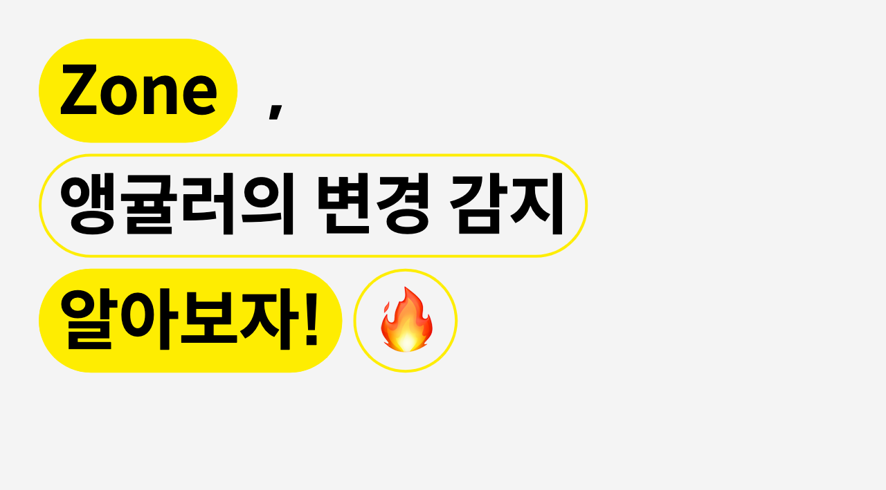
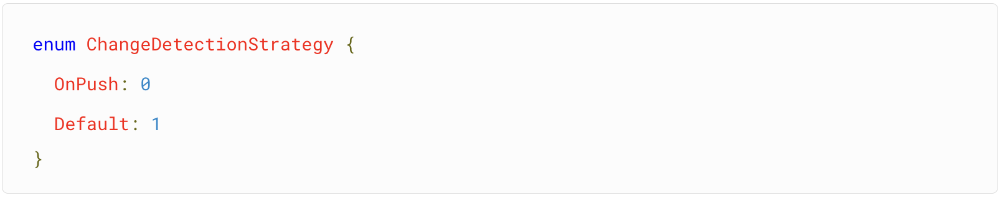
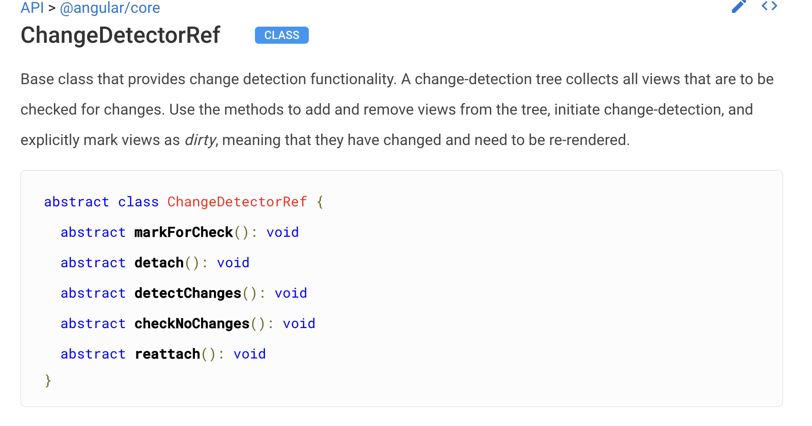

### zone

`zone.js`은 비동기 실행들을 하나의 맥락(실행 컨텍스트)으로 다룰 수 있도록 해준다.

1. 비동기 api들을 런타임(코드가 실행이 될 때)에 코드의 동작을 동적으로 업데이트(`몽키패치`) 해서,

2. zone 자신의 api로 바꿔버려(`후킹`),

   >

3. 비동기 api들의 사용을 통지 받을 수 있고,

따라서 비동기 컨텍스트를 하나로 관리 할 수 있도록 도와준다.

 

### 변경감지

리액트를 사용할 때 재 랜더링에 대해 생각을 하면서 코딩을 하곤 했었다.  
state, props의 변경과 부모컴포넌트의 재랜더링은 자식 컴포넌트를 다시 랜더링시키는데,  
재랜더링을 하는 이유는 하면의 데이터를 바꾸기 위함이다.

앵귤러가 화면의 데이터를 바꾸는 방식은 변경감지(change detection)를 통해 바꾼다. 이는 다시 랜더링 시킨다는 말이다.

 

앵귤러는

- zone을 통해 코드와 로직이 실행되는 `상황` 을 감지한다. (특정 데이터 자체의 변경을 통지 받는것이 아님)

- native api들의 호출을 zone이 알고 있고, 변경 감지를 수행한다.

- 따라서 내부의 디렉티브,서비스뿐만 아니라 외부 라이브러리의 이벤트도 zone덕분에 변경 감지를 수행 할 수 있다.

다만 zone은 언제 변경감지(change detection)을 해야하는지만 알려준다.

변경 감지는 (viewRef가 상속하고 있는 changeDetectorRef를) 루트부터 아래로 내려가면서 순차적으로 진행되어야 어떤것이 변경되었는지 알고, 바꿀 수 있다.

 

### 변경감지 전략

앵귤러는 change detection이 시작되면, 루트부터 모든 컴포넌트를 순회한다.

(ngOnChange의 경우 @input이 변경될때만 호출되지만 ngDoCheck는 매번 호출되는걸 생각한다면 이해하기 쉽다.)

이벤트가 발생할 때마다 모든 컴포넌틀를 순회하니, `데이터가 변경되는곳만` 확인한다면 성능 향상을 바랄 수 있다.

 

---

 

부모 컴포넌트, 자식 컴포넌트와의 관계에서  
자식은 부모에게서 받은 데이터만 보여준다고 할 때,  
부모의 데이터가 변경되지 않는다면  
→ 자식의 데이터도 변경되지 않는다.  
**이 때 자식 컴포넌트는 change detection에서 제외 되어도 된다.**

따라서 부모의 **데이터의 레퍼런스 비교**를 통해 데이터가 바뀌었는지 안바뀌었는지 아는게 핵심이다.
(객체가 통째로 바뀔땐 변경감지 프로세스가 작동하고, 객체의 프로퍼티가 바뀔땐 작동하지 않는다)

앵귤러 컴포넌트 데코레이터에 changeDetection 프로퍼티로 전략을 설정할 수 있는데, 이는 changeEtectionStarategy.Default, changeEtectionStarategy.OnPush 두가지가 있다.
위에서 계속 설명했던, 데이터가 변경되는곳만 확인하기 위해선 OnPush 전략을 사용하면 된다.

 

알아두면 좋은 onpush tmi

1. OnPush전략이 제대로 사용되고 있는지 알기 위해선 ngDoCheck 메소드를 활용해본다면 쉽게 테스트 할 수 있다.
2. OnPush전략을 사용하는 컴포넌트 자체는 매번 ngDoCheck가 실행된다. 레퍼런스가 바뀌는지 안바뀌는지 알아야 자식 컴포넌트들의 change Detection 순회를 하지 않기 때문이다. 따라서 자식 컴포넌트가 많은 복잡한 컴포넌트 일수록 성능 개선 효과가 크다
3. 불변객체를 사용 할 때 OnPush 전략을 사용하기 쉽다. 객체가 바뀔때마다 레퍼런스를 바꾸기 때문!

 

### ChangeDetectorRef

변경감지를 세밀하게 조정할 수 있는 객체이다.

1. `detach` 메소드를 통해 변경감지 트리에서 분리할 수 있다.

> 루트부터 순회하는 변경감지 순회에서 분리되어 따로 변경감지 트리를 만드는것이므로,
> 해당하는 컴포넌트와 자식 컴포넌트는 zone에 의해 루트부터 시작된 변경감지가 수행되지 않는다.

2. `reattach` 메소드를 통해 분리되었던 변경감지 트리를 다시 붙일 수 있다.

3. `detectChanges` 메소드는 `즉시` 자신과 자식 컴포넌트의 변경감지 순회를 시작한다. 즉시 해당 컴포넌트를 재랜더링 시키고 싶을 때 사용한다.

4. `markForCheck`는 `변경감지 순회를 시작하는것이 아니라`, 다음번 변경감지 순회때 순회를 시키도록 체크해 두는것이다.

 

참고

[https://norux.me/64](https://norux.me/64)

[https://angular.io/api/core/ChangeDetectorRef](https://angular.io/api/core/ChangeDetectorRef)

[https://www.thisdot.co/blog/zone-js-deep-diving-execution-context](https://www.thisdot.co/blog/zone-js-deep-diving-execution-context)

제대로 배우는 앵귤러4
