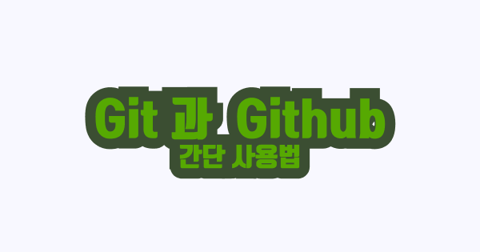
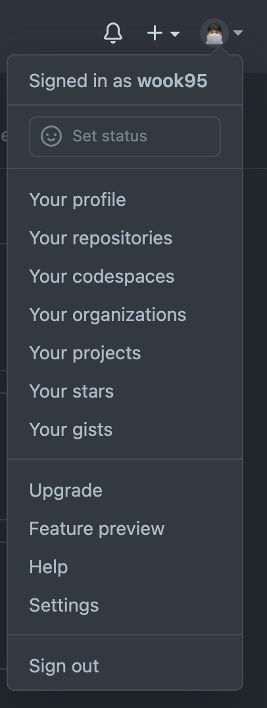

<br>

#### 0. 버전 관리의 이유

- 수정할때 마다 파일 새로 만들기 힘듬, 이전 버전으로 돌아가고, 이력을 남기기 위해(백업)
- 협업하기 위해

#### 0-1. GitHub

- git을 사용한 프로젝트 저장소
- 개발자들의 SNS
<br><br>  

깃을 사용하는 흐름을 제가 생각했을땐 크게 두가지인것 같습니다.

1. 내 컴퓨터에 있는 코드를 깃으로 관리하고, 깃헙에 올리기 ! (로컬 -> 원격)
2. 남이 쓴 코드를 받아와 작업하기! (원격 -> 로컬)

지금부터 아주 간단한 cli로! 깃 한번 써보겠습니다.
<br><br>  <br><br>  

### 1.  로컬에 작업하고, 빈 레포에 푸쉬하기

- `cd 작업할 폴더`

- `git init` : 이제 깃을 쓰겠습니다.

- `git status` : 현재 상태 보기 (스테이지에 올라갔나 확인, 수정된 파일 확인)

  ​               -코딩 -

- `git add` : 스테이지에 올린다! (git add . :모든 코드를 스테이징) ,  
커밋과 add가 따로 나눠져 있는 이유는, git으로 관리하는 폴더에서 올리고 싶은것만 올릴려고(작업내역으로 남기고 싶은 부분만 남기려고)  <br><br>
- `git commit` : 작업단위..! 이름을 붙여서 스테이지에 올린 파일들 사진을 찍는다 (작업 단위로 나눠 이름을 붙여 저장!)

- `git log` :  커밋 로그를 본다 (나오고 싶으면 q)

- `git remote add origin 주소` : 원격 브랜치를 등록

- `git push origin main`  : 원격(origin)의 메인에 푸쉬
<br><br><br>

### 2. 클론 받아와서 작업하고 올려보자

- 로컬과 리모트

1. (이미 있는 코드)레포 → 클론 → 변경 → 푸쉬 (오후)

```tsx
cd 작업폴더                    : 작업할 폴더로 이동
git clone https://github.com/유저이름/레포이름.git : 깃헙에 올라온 코드 내 컴퓨터로 내려받기!
git branch 브랜치명                : 브랜치 생성
git checkout 브랜치명               : 브랜치로 이동!

- 작업후 -

git add .                : 작업폴더에 있는 모든 변경사항을 스테이지로 
git commit -m ""             : 커밋합니다
git push origin 브랜치           : origin이라는 이름의 원격 저장소의 브랜치 브랜치에 푸쉬

- 메인으로 머지 하지 말고 PR 날리기 !
```

2. (PR 완료 후 마스터에 머지 된 후엔) 풀 받아옴 (업데이트)

- pull (파일 다운 + 병합) , fetch (파일 다운만, 병합은 따로 해야함)
- 로컬 메인에서는 풀만 받으면 된다 ~! (협업시)
<br><br><br>

### 3. 깃 CLI 명령어

<br>
내 브랜치가 master인가? main 인가?
<br><br>

- git branch : 로 현 브랜치가 master인지 main인지 마스터인지 확인

- (git branch -M main : 브랜치 이름 메인을 ㅗ바꿈,, ?)

- git push origin main : 원격 저장소 메인을 푸쉬 (마스터면 마스터)

- git config --global init.defaultBranch main : 기본 브랜치를 main으로 (루트에 있는 .gitconfig에서도 변경가능)
<br><br>

리모트에 대해

- git remote -v : 원격 브랜치가 어디에 연결되었느지 확인

- git remote : 원격 브랜치 이름 확인

- git remote add <name>(보통 origin 넣는다) <url> : 원격 저장소 연결

- git remote remove name (보통 origin)

<br>
푸쉬
<br><br>

- git push <저장소명>(보통 origin) <브랜치명>
- git push -u 저장소명 브랜치명 : 저장소명과 브랜치를 저장해 그냥 push 해도 저장소명, 브랜치명 날라감
- git push -f : 강제로 푸쉬

<br>
추가사항
<br><br>

- git add -p : 대화식으로 변경된 부분을 선택합니다

```
hunk라는 작은 단위로 변경된 것들을 하나씩 보면서 add 합니다.

hunk를 보면서 할 수 있는 옵션들
y - yes 이 hunk를 스테이지에 올립니다.
n - no 이 hunk를 스테이지에 안 올립니다.
a - all 이 파일에 있는 모든 hunk를 스테이지에 올립니다.
d - do not stage 이 파일의 모든 hunk를 스테이지에 안 올립니다.

j - 이 hunk를 정하지 않고 넘어갑니다, 다음 정하지 않은 hunk를 봅니다.
J - 이 hunk를 정하지 않고 넘어갑니다, 다음 hunk를 봅니다.
k - 이 hunk를 정하지 않고 넘어갑니다, 다음 정하지 않은 hunk를 봅니다.
K - 이 hunk를 정하지 않고 넘어갑니다, 다음 hunk를 봅니다.
```

```tsx
깃허브에서 처음 레포 만들면 나오는 cli 도움말 !

//or create a new repository on the command line
echo "# gitPractice-2" >> README.md
git init
git add README.md
git commit -m "first commit"
git branch -M main
git remote add origin <https://github.com/wook95/gitPractice-2.git>
git push -u origin main

//or push an existing repository from the command line
git remote add origin <https://github.com/wook95/gitPractice-2.git>
git branch -M main
git push -u origin main
```

<br><br>

### 4. CLI로 푸쉬가 안 될 때

`만난 오류메세지`

remote: Support for password authentication was removed on August 13, 2021. Please use a personal access token instead.
remote: Please see <https://github.blog/2020-12-15-token-authentication-requirements-for-git-operations/> for more information.

올해 8월 13일부로 패스워드 인증은 끝났다 ,,, 토큰을 발급 받으라는 깃허브



그림 젤 하단쪽 세팅 -> 왼쪽 네비 바 밑쪽의 Developer settings -> Personal accesss tokens 들어갑니다.

[토큰 발급받기](https://github.com/settings/tokens)

이름은 원하시는대로 짓고, 권한은 다 체크! 발급!🥳

한번만 보여주고 다시 안 보여주니까 보관 잘 해놓기 !<br><br><br>

깃허브 인증 초기화, 아이디 재등록 과정

`cd 작업할 프로젝트 폴더`

`git config --unset credential.helper`

`git push`

`Username for 'https://github.com : 유저네임'`

`Password for 'https://유저네임@github.com : 패스워드'`

해결!

<br>
참고한 곳 :

<https://gist.github.com/mattlewissf/9958704>
